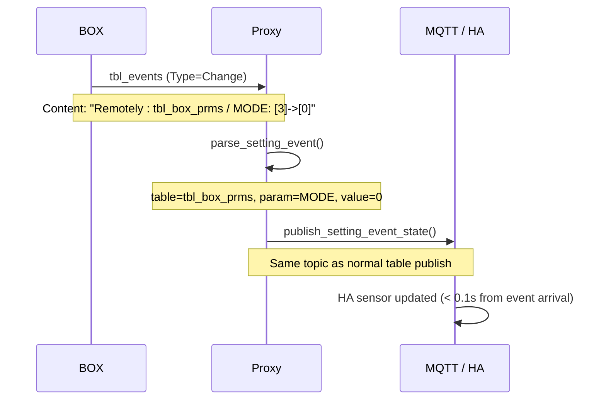

# Event-Driven Sensor Updates

## Overview

When the BOX applies a setting change, it sends `tbl_events` messages back to the proxy to confirm each updated parameter. The proxy parses these events and immediately publishes the new value to MQTT, without waiting for the next full table poll.

This means Home Assistant reflects parameter changes within milliseconds of the BOX's ACK arriving, rather than potentially waiting minutes for the next normal data cycle.

## How It Works

### The Event Flow

1. A setting command is sent to the BOX (e.g., change `MODE` from 3 to 0).
2. The BOX applies the change and sends one or more `tbl_events` messages as ACK.
3. Each event has `Type=Change` and a `Content` field describing what changed.
4. The proxy parses the `Content`, extracts the new value, and publishes it to MQTT.

The published topic and payload format are identical to what a normal table poll would produce. From Home Assistant's perspective, the update is indistinguishable from a regular sensor update.

### Event Format

The BOX uses this format in the `Content` field of `tbl_events`:

```
Remotely : {table} / {param}: [{old_value}]->[{new_value}]
```

Examples from real captures:

```
Remotely : tbl_box_prms / MODE: [3]->[0]
Remotely : tbl_boiler_prms / MANUAL: [0]->[1]
```

The proxy extracts `table`, `param`, and `new_value` from this string.

### Infrastructure

The parsing and publishing logic lives in two places:

- `control_settings.py` - `parse_setting_event()` extracts table/param/value via regex
- `control_pipeline.py` - `handle_setting_event()` coordinates parsing and publishing; `publish_setting_event_state()` writes to MQTT

The implementation is generic. It handles any parameter that matches the event format, regardless of which table or parameter name it is. No parameter-specific branching exists in the code.

## Supported Parameters

These are the parameters confirmed in captured data:

| Parameter | Table | Notes |
|-----------|-------|-------|
| `MODE` | `tbl_box_prms` | Operating mode (e.g., 0=offline, 3=online) |
| `MANUAL` | `tbl_boiler_prms` | Manual boiler control |

Any other parameter that the BOX includes in a `tbl_events` ACK will also be handled automatically, since the infrastructure is generic.

## Timing

| Metric | Value |
|--------|-------|
| Average processing time per event | < 0.1 seconds |
| Target requirement | < 5 seconds |
| Margin | ~50x faster than requirement |

The limiting factor is network latency between BOX and proxy, not processing overhead. In practice, from the moment the BOX sends the ACK event to the moment MQTT receives the updated value is well under a second on a local network.

## Comparison: Before and After

Without event-driven updates, the sensor update sequence looked like this:

1. User sends setting change.
2. BOX applies it and ACKs.
3. Proxy delivers the Setting frame result.
4. Sensor in HA still shows the old value.
5. BOX sends next full table data (minutes later, depending on poll interval).
6. Proxy publishes new value.
7. HA updates.

With event-driven updates:

1. User sends setting change.
2. BOX applies it and sends `tbl_events` ACK.
3. Proxy parses the event immediately.
4. Proxy publishes new value to MQTT.
5. HA updates. Total time from BOX ACK: < 0.1s.

## Sequence Diagram



## Test Coverage

35 tests were added to verify this behavior:

### Unit Tests (`tests/test_event_parser.py`) - 24 tests

Cover the `parse_setting_event()` function:

- MODE change events from `tbl_box_prms`
- MANUAL change events from `tbl_boiler_prms`
- Integer and float value handling
- Malformed content (returns `None` gracefully)
- Wrong event type (non-Change events ignored)
- Edge cases: empty content, missing fields, unexpected table names

### Integration Tests (`tests/test_event_integration.py`) - 11 tests

Cover the end-to-end flow from raw event data to MQTT publish:

| Test | What It Verifies |
|------|-----------------|
| `test_mode_change_event_flow` | MODE change triggers correct MQTT publish |
| `test_manual_change_event_flow` | MANUAL change triggers correct MQTT publish |
| `test_publish_setting_event_state_integration` | MQTT topic and payload correctness |
| `test_non_setting_event_ignored` | Non-Change events don't trigger publish |
| `test_non_events_table_ignored` | Only `tbl_events` rows are processed |
| `test_invalid_event_content_ignored` | Bad content handled without crash |
| `test_multiple_events_sequential` | Multiple events in sequence all processed |
| `test_event_with_float_values` | Float values round-trip correctly |
| `test_empty_content_ignored` | Empty string content handled gracefully |
| `test_none_parsed_ignored` | None data handled gracefully |
| `test_event_timing_benchmark` | Processing stays under 5s target |

All 35 tests pass. No regressions were introduced (832 existing tests pass).

## Notes

The event-driven update path does not replace normal table polling. Both paths publish to the same MQTT topics. Normal polling continues to run on its regular schedule and will overwrite the event-published value on the next cycle, but by then the value should be identical since the BOX has already applied the change.

If the BOX sends no `tbl_events` for a parameter change (for example, changes that don't go through the Setting command flow), the event-driven path won't fire. Normal polling will still eventually publish the correct value.
