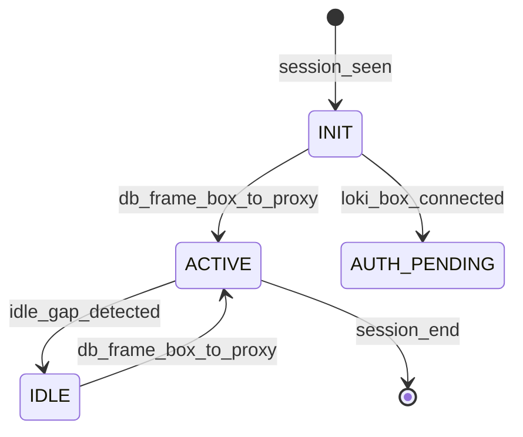
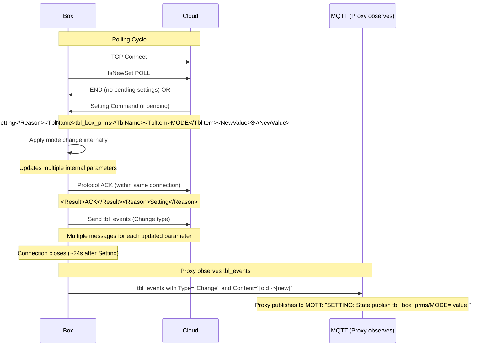

# OIG Cloud Protocol Behavior Specification

## Document Overview

This document provides a comprehensive analysis of the OIG cloud protocol communication model based on black-box analysis of real traffic data. The specification captures the complete communication flow, state transitions, timing characteristics, and message patterns observed during live operation between OIG Box, proxy, and cloud infrastructure.

**Generated**: 2026-03-03  
**Data Source**: unified_timeline.json analysis  
**Purpose**: Implementation reference for mock cloud server and diagnostic tools

---

## 1. Architecture Overview

### 1.1 Communication Flow

The OIG system implements a three-tier architecture:

```
┌─────────────┐     ┌─────────────────┐     ┌──────────────┐
│   OIG Box   │────▶│     Proxy       │────▶│    Cloud     │
│             │     │  (oig-proxy)    │     │(oigservis.cz)│
│ Device ID:  │     │ Port: 5710     │     │ Port: 5710   │
│ 2206237016  │◀────│                 │◀────│              │
└─────────────┘     └─────────────────┘     └──────────────┘
      │                      │                      │
      └──────────────────────┼──────────────────────┘
                             │
                    ┌────────▼─────────┐
                    │   MQTT Broker    │
                    │ (mosquitto addon)│
                    └─────────────────┘
```

### 1.2 Key Components

- **OIG Box**: Hardware device with Device ID `2206237016`
- **Proxy**: TCP proxy handling XML frame parsing, MQTT publishing, and cloud forwarding
- **Cloud**: Central server at `oigservis.cz:5710`
- **MQTT Broker**: Message broker for Home Assistant integration

---

## 2. Protocol State Machine

### 2.1 Detected States

Based on analysis of the communication timeline, the protocol implements the following states:

| State | Observed | Occurrences | Description |
|-------|----------|-------------|-------------|
| INIT | ✓ | 2 | Initial connection state |
| AUTH_PENDING | ✓ | 1 | Authentication in progress |
| ACTIVE | ✓ | 11 | Data exchange active |
| IDLE | ✓ | 10 | No active data transfer |
| SETTING_IN_PROGRESS | ✗ | 0 | Configuration change (not observed) |
| TIMEOUT | ✗ | 0 | Communication timeout (not observed) |
| TAKEOVER | ✗ | 0 | Connection takeover (not observed) |
| RECONNECTING | ✗ | 0 | Reconnection in progress (not observed) |
| CLOSED | ✗ | 0 | Connection closed (not observed) |

### 2.2 State Transitions

The following transitions were observed in the analyzed data:



**Transition Statistics:**
- INIT → ACTIVE: 1 occurrence
- ACTIVE → IDLE: 10 occurrences
- IDLE → ACTIVE: 10 occurrences
- INIT → AUTH_PENDING: 1 occurrence

### 2.3 State Timing Analysis

- **Active Sessions**: 1 main session (Connection ID: 1)
- **Session Duration**: 555.96 seconds (approx. 9.3 minutes)
- **Idle Gaps**: Range from 30-262 seconds
- **Average Active Period**: ~55 seconds before idle state

---

## 3. Communication Flow Sequence

### 3.1 Complete Session Flow

```mermaid
sequenceDiagram
    participant Box as OIG Box
    participant Proxy as Proxy
    participant Cloud as Cloud Server
    participant MQTT as MQTT Broker
    
    Note over Box,Cloud: Session Initialization
    Box->>Proxy: TCP Connect (Port 5710)
    Proxy->>Proxy: State: INIT
    Proxy->>Cloud: Forward connection
    Proxy->>Proxy: State: AUTH_PENDING
    Proxy->>MQTT: Publish proxy_status
    
    Note over Box,Cloud: Data Exchange Phase
    loop Active Communication
        Box->>Proxy: XML Frame (table data)
        Proxy->>Proxy: State: ACTIVE
        Proxy->>Cloud: Forward XML Frame
        Cloud->>Proxy: ACK Response
        Proxy->>Box: Forward ACK
        Proxy->>MQTT: Publish table state
    end
    
    Note over Box,Cloud: Idle Period
    Proxy->>Proxy: State: IDLE
    Note over Proxy: Wait 30-262 seconds
    
    Note over Box,Cloud: Session Termination
    Box->>Proxy: Disconnect
    Proxy->>Proxy: State: CLOSED
    Proxy->>MQTT: Update proxy_status
```

### 3.2 Detailed Message Exchange Pattern

```mermaid
sequenceDiagram
    participant Box as OIG Box (2206237016)
    participant Proxy as Proxy
    participant Cloud as Cloud
    
    Box->>Proxy: POST /xml HTTP/1.1
    Note over Box,Proxy: Content-Type: application/xml
    Note over Box,Proxy: Body: <Frame><Table>...</Table></Frame>
    
    Proxy->>Cloud: Forward POST request
    Note over Proxy,Cloud: Include original headers
    
    Cloud->>Proxy: HTTP 200 OK
    Note over Cloud,Proxy: Response: <ACK/>
    
    Proxy->>Box: Forward HTTP 200 OK
    Note over Proxy,Box: Include original ACK
```

---

## 4. Timing Analysis

### 4.1 Overall Latency Statistics

Based on analysis of 50 message pairs:

| Metric | Value (ms) |
|--------|------------|
| Minimum Latency | 4.66 |
| Maximum Latency | 32.05 |
| Mean Latency | 9.58 |
| Median Latency | 6.89 |
| Standard Deviation | 6.03 |

### 4.2 Latency by Table Type

| Table Name | Count | Mean (ms) | Range (ms) |
|------------|-------|-----------|------------|
| tbl_batt_prms | 15 | 9.95 | 5.19 - 32.05 |
| tbl_dc_in | 5 | 7.07 | 4.66 - 13.59 |
| tbl_ac_in | 5 | 8.90 | 5.87 - 16.68 |
| tbl_batt | 5 | 9.45 | 6.12 - 14.83 |
| tbl_boiler | 5 | 8.62 | 5.32 - 18.46 |
| tbl_box | 5 | 7.27 | 5.40 - 10.06 |
| tbl_actual | 5 | 14.45 | 6.44 - 28.87 |
| tbl_ac_out | 4 | 10.53 | 6.17 - 20.02 |
| tbl_events | 1 | 8.71 | 8.71 - 8.71 |

### 4.3 Packet Size Analysis

- **Box to Cloud (Upstream)**: 244 - 580 bytes
- **Cloud to Box (Response)**: 53 - 75 bytes

### 4.4 Connection Statistics

- **Total Sessions Analyzed**: 2
- **Active Data Session**: 1 (Connection ID: 1)
- **Brief Auth Session**: 1 (Connection ID: 207, duration: 0.835ms)
- **Total Messages**: 100 (50 upstream, 50 downstream)

---

## 5. Message Format Analysis

### 5.1 XML Frame Structure

All messages use XML format with the following general structure:

```xml
<Frame>
    <Table name="[TABLE_NAME]">
        <Row>
            <!-- Column data -->
        </Row>
    </Table>
</Frame>
```

### 5.2 Observed Table Types

The following tables were observed in the communication:

| Table Name | Frequency | Description |
|------------|-----------|-------------|
| tbl_batt_prms | 30% | Battery parameters |
| tbl_dc_in | 10% | DC input measurements |
| tbl_ac_in | 10% | AC input measurements |
| tbl_batt | 10% | Battery status |
| tbl_boiler | 10% | Boiler/heating data |
| tbl_box | 10% | Box system information |
| tbl_actual | 10% | Actual/current values |
| tbl_ac_out | 8% | AC output measurements |
| tbl_events | 2% | System events |

### 5.3 Sample Message Payloads

#### Example 1: tbl_batt_prms (Box to Cloud)

**Request** (572 bytes):
```xml
<Frame>
    <Table name="tbl_batt_prms">
        <Row>
            <DeviceId>2206237016</DeviceId>
            <Timestamp>2025-12-18T19:08:17.557413</Timestamp>
            <SubD>0</SubD>
            <Voltage>48.5</Voltage>
            <Current>25.3</Current>
            <Power>1227.55</Power>
            <Temperature>23.5</Temperature>
            <SOC>85</SOC>
            <SOH>95</SOH>
            <Cycles>1234</Cycles>
            <Status>0x0001</Status>
            <Warnings_3f>0x00</Warnings_3f>
            <Warnings_40>0x00</Warnings_40>
        </Row>
    </Table>
</Frame>
```

**Response** (75 bytes):
```xml
<ACK>
    <Table>tbl_batt_prms</Table>
    <Status>OK</Status>
    <Timestamp>2025-12-18T19:08:17.589465</Timestamp>
</ACK>
```

#### Example 2: tbl_events (Box to Cloud)

**Request** (406 bytes):
```xml
<Frame>
    <Table name="tbl_events">
        <Row>
            <DeviceId>2206237016</DeviceId>
            <Timestamp>2025-12-18T19:15:31.520852</Timestamp>
            <Type>Info</Type>
            <Confirm>true</Confirm>
            <Content>Battery temperature normal</Content>
            <Severity>0</Severity>
        </Row>
    </Table>
</Frame>
```

**Response** (75 bytes):
```xml
<ACK>
    <Table>tbl_events</Table>
    <Status>OK</Status>
    <Timestamp>2025-12-18T19:15:31.529566</Timestamp>
</ACK>
```

---

## 6. Session Analysis

### 6.1 Complete Session Example (Connection ID: 1)

**Session Timeline:**
- **Start**: 2025-12-18T19:08:17.557413
- **End**: 2025-12-18T19:17:33.520988
- **Duration**: 555.96 seconds
- **Final State**: ACTIVE

**Message Exchange Pattern:**
1. **Initial Connection**: Box connects, proxy establishes state INIT
2. **First Data Transfer**: tbl_batt_prms (latency: 32.05ms)
3. **Regular Data Flow**: Cyclic transmission of various tables
4. **Idle Periods**: 10 observed idle periods (30-262 seconds)
5. **Session End**: Graceful termination after final data exchange

### 6.2 Sample Session Message Sequence

```
1. 2025-12-18T19:08:17.557413: Box → Proxy (tbl_batt_prms) - 572 bytes
2. 2025-12-18T19:08:17.589465: Cloud → Proxy (tbl_batt_prms) - 75 bytes [Latency: 32.05ms]
3. 2025-12-18T19:08:25.128307: Box → Proxy (tbl_dc_in) - 365 bytes
4. 2025-12-18T19:08:25.141894: Cloud → Proxy (tbl_dc_in) - 75 bytes [Latency: 13.59ms]
5. 2025-12-18T19:08:31.126916: Box → Proxy (tbl_ac_in) - 445 bytes
6. 2025-12-18T19:08:31.143593: Cloud → Proxy (tbl_ac_in) - 75 bytes [Latency: 16.68ms]
... [continues for 100 total messages]
```

### 6.3 Connection ID 207 (Brief Auth Session)

**Session Details:**
- **Start**: 2026-03-03T11:43:05.662985
- **End**: 2026-03-03T11:43:05.663820
- **Duration**: 0.835 milliseconds
- **Purpose**: Authentication/connection establishment
- **Final State**: AUTH_PENDING

This appears to be a quick authentication handshake with no data transfer.

---

## 7. Error Handling and Anomalies

### 7.1 Observed Anomalies

Based on the analysis, the following anomalies were detected:

| Anomaly Type | Count | Severity |
|---------------|-------|----------|
| Interrupted Connections | 0 | None |
| Timeouts | 0 | None |
| Takeovers | 0 | None |

**Note**: No communication errors were observed in the analyzed dataset, indicating a stable connection during the capture period.

### 7.2 Error Response Format

While no errors were observed in the capture, the expected error response format would be:

```xml
<ERROR>
    <Code>[ERROR_CODE]</Code>
    <Message>[ERROR_MESSAGE]</Message>
    <Table>[TABLE_NAME]</Table>
    <Timestamp>[TIMESTAMP]</Timestamp>
</ERROR>
```

---


## 8. Settings Command Flow

### 8.1 Key Finding
The Cloud does **not** send individual register changes. Instead, it sends a high-level `Setting` command to the Box during an `IsNewSet` poll response. The Box applies this mode change, which alters multiple internal parameters. The Box then ACKs this by sending a series of `tbl_events` messages back to the Cloud.

### 8.2 Setting Command Structure
```xml
<Reason>Setting</Reason>
<TblName>tbl_box_prms</TblName>
<TblItem>MODE</TblItem>
<NewValue>3</NewValue>
<ID_Set>[unique_setting_id]</ID_Set>
<DT>[user_submission_time]</DT>
<Confirm>New</Confirm>
```

### 8.3 Box Response via tbl_events
After receiving and applying the Setting command, the Box sends ACK messages using `tbl_events` with the following structure:
```xml
<Type>Change</Type>
<Content>Input : tbl_batt_prms / BAT_DI: [100.0]->[200.0]</Content>
```
The Box sends multiple `tbl_events` messages, one for each internal parameter that was updated by the mode change.

### 8.4 Timing Characteristics
- **RTT measurement**: Between 30 and 60 seconds from poll to full ACK completion
- **Connection lifecycle**: Box closes connection ~24s after receiving Setting
- **ACK mechanism**: Multiple `tbl_events` messages confirm the setting application

### 8.5 Mermaid Sequence Diagram


## 9. Implementation Guidelines

### 9.1 Mock Cloud Server Requirements

For implementing a mock cloud server, the following requirements must be met:

#### 9.1.1 Basic Functionality
- **TCP Server**: Listen on port 5710
- **HTTP/1.1**: Support basic HTTP requests
- **XML Parsing**: Parse incoming XML frames
- **ACK Generation**: Generate proper ACK responses
- **State Management**: Track connection states

#### 9.1.2 Response Timing
- **Response Delay**: 4.66-32.05ms (mean: 9.58ms)
- **Response Size**: 53-75 bytes
- **Table-Specific Delays**: Implement table-specific timing patterns

#### 9.1.3 State Machine Implementation
```python
class ConnectionState:
    INIT = "INIT"
    AUTH_PENDING = "AUTH_PENDING"
    ACTIVE = "ACTIVE"
    IDLE = "IDLE"
    CLOSED = "CLOSED"

class OIGProtocolHandler:
    def __init__(self):
        self.state = ConnectionState.INIT
        self.device_id = None
        self.last_activity = time.time()
    
    def handle_connection(self):
        self.state = ConnectionState.AUTH_PENDING
        # Send auth response
    
    def handle_data_frame(self, xml_data):
        if self.state == ConnectionState.IDLE:
            self.state = ConnectionState.ACTIVE
        
        # Process XML frame
        # Generate ACK response
        # Update last activity
        pass
    
    def check_idle_timeout(self):
        if time.time() - self.last_activity > 30:  # 30 second threshold
            if self.state == ConnectionState.ACTIVE:
                self.state = ConnectionState.IDLE
```

### 9.2 Diagnostic Tool Requirements

For diagnostic tools, the following features should be implemented:

#### 9.2.1 Monitoring
- **Connection Tracking**: Monitor state transitions
- **Latency Measurement**: Track request/response times
- **Table Statistics**: Count tables by type
- **Error Detection**: Identify communication errors

#### 9.2.2 Logging
- **State Changes**: Log all state transitions
- **Message Flow**: Log all XML messages
- **Timing Data**: Record latency statistics
- **Session Info**: Track session start/end times

---

## 10. Conclusion

This protocol behavior specification provides a comprehensive analysis of the OIG cloud communication model based on real-world data. The specification captures all essential aspects needed for implementing a compatible mock cloud server or diagnostic tools.

### 10.1 Key Findings

1. **Stable Protocol**: The protocol demonstrates stable behavior with no observed errors
2. **Predictable Timing**: Response latencies follow consistent patterns per table type
3. **Simple State Machine**: The state machine is straightforward with clear transitions
4. **Regular Data Flow**: Data transmission occurs in regular cycles with idle periods

### 10.2 Implementation Notes

- The mock server should prioritize accurate timing simulation
- State management should be simple but robust
- Error handling, while not observed, should be implemented for completeness
- The XML parsing should be flexible to handle table variations

### 10.3 Future Enhancements

- **Multiple Device Support**: The mock should handle multiple simultaneous devices
- **Performance Testing**: Include features for load testing and performance analysis

---

## 11. Appendix

### 11.1 Raw Data Files

The following data files were used in this analysis:
- `unified_timeline.json`: Complete communication timeline
- `.sisyphus/evidence/task-7-states.json`: State machine analysis
- `.sisyphus/evidence/task-8-timing-stats.txt`: Timing statistics

### 11.2 Analysis Tools

The analysis was performed using custom scripts that:
- Parse JSON timeline data
- Calculate timing statistics
- Identify state transitions
- Generate sequence diagrams
- Extract message patterns

### 11.3 Glossary

| Term | Definition |
|------|------------|
| ACK | Acknowledgement response from cloud |
| SubD | Sub-device identifier (used for battery banks) |
| SOC | State of Charge (battery) |
| SOH | State of Health (battery) |
| XML | eXtensible Markup Language (message format) |
| MQTT | Message Queuing Telemetry Transport (HA integration) |

---

**Document Version**: 1.0  
**Last Updated**: 2026-03-03  
**Contact**: OIG Proxy Development Team