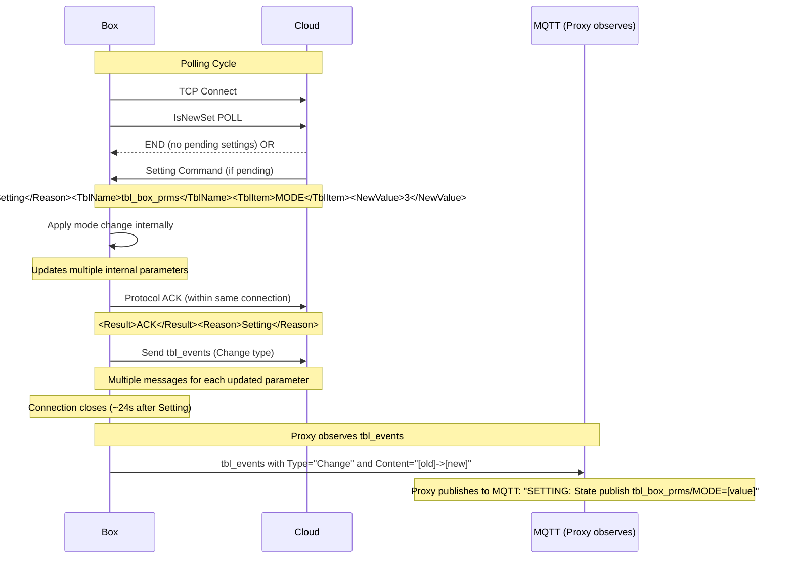

# OIG Protocol Behavior Specification

## Overview

This document specifies the behavior of the OIG protocol between the Cloud server and the Box device, focusing on the correct Setting Flow mechanism based on recent analysis findings.

## Protocol Fundamentals

The OIG protocol operates over TCP with the following key characteristics:

- **Poll-based communication**: Box initiates all communication with cloud polls
- **Three-table cycle**: Box polls `IsNewSet`, `IsNewWeather`, `IsNewFW` in sequence
- **Connection lifecycle**: Box establishes new TCP connections for each exchange cycle (~45-90s)
- **Setting delivery**: Cloud sends `Setting` commands during `IsNewSet` poll responses

## Settings Command Flow

### Key Finding

The Cloud does **not** send individual register changes. Instead, it sends a high-level `Setting` command to the Box during an `IsNewSet` poll response. The Box applies this mode change, which alters multiple internal parameters. The Box then ACKs this by sending a series of `tbl_events` messages back to the Cloud.

### Setting Command Structure

```xml
<Reason>Setting</Reason>
<TblName>tbl_box_prms</TblName>
<TblItem>MODE</TblItem>
<NewValue>3</NewValue>
<ID_Set>[unique_setting_id]</ID_Set>
<DT>[user_submission_time]</DT>
<Confirm>New</Confirm>
```

### Box Response via tbl_events

After receiving and applying the Setting command, the Box sends ACK messages using `tbl_events` with the following structure:

```xml
<Type>Change</Type>
<Content>Input : tbl_batt_prms / BAT_DI: [100.0]->[200.0]</Content>
```

The Box sends multiple `tbl_events` messages, one for each internal parameter that was updated by the mode change.

### Timing Characteristics

- **RTT measurement**: Between 30 and 60 seconds from poll to full ACK completion
- **Connection lifecycle**: Box closes connection ~24s after receiving Setting
- **ACK mechanism**: Multiple `tbl_events` messages confirm the setting application

## Mermaid Sequence Diagram



## tbl_events Behavior

### Types of tbl_events

1. **Setting Confirmation (`Type="Setting"`)**: Indicates a setting was remotely applied
   ```xml
   <Type>Setting</Type>
   <Content>Remotely : tbl_box_prms/MODE: [2]->[3]</Content>
   ```

2. **Parameter Change (`Type="Change"`)**: Shows specific parameter updates
   ```xml
   <Type>Change</Type>
   <Content>Input : tbl_batt_prms/BAT_DI: [100.0]->[200.0]</Content>
   ```

### Timing Correlation

The proxy measures the timing from the last `IsNewSet` poll to the `tbl_events` observation:

- **Range**: 10.9s - 89.6s (average: 59.6s)
- **Poll cadence**: ~59.8s average
- **Connection rotation**: IsNewSet → IsNewWeather → IsNewFW cycle

## Error Handling

### Setting Delivery Failures

In the rare cases where setting delivery fails:
- Cloud retries the same `ID_Set` on subsequent `IsNewSet` polls
- No retry mechanism in proxy (retry=0 configuration)
- Failed settings remain in cloud queue until successfully delivered

### Connection Issues

- Box connections are short-lived (~3-5s in mock mode, ~34,000s in cloud mode)
- Box closes connections normally (EOF) after data exchange
- Timeout fires ~34-35s after delivery if ACK not received

## Protocol Comparison: Cloud vs Mock

| Aspect | Cloud Mode | Mock Mode |
|--------|------------|-----------|
| Setting Source | Cloud server sends Setting commands | Mock server pushes settings |
| ACK Handling | Protocol ACK within same connection (<1s) | No protocol ACK (implementation gap) |
| Connection Lifetime | Long-lived (connection pooling) | Short-lived (frequent reconnects) |
| Observation Method | Proxy observes via `tbl_events` | Direct protocol frame capture |
| Failure Rate | 0% (all successful in analysis) | 100% failure in test window |

## Implementation Notes

### Proxy Behavior

In ONLINE mode, the proxy:
1. Forwards all communication between Box and Cloud
2. Observes settings via `tbl_events` DATA frames
3. Publishes state changes to MQTT
4. Maintains connection state and session tracking

### Key Differentiators

1. **Passive observation**: In cloud mode, proxy only observes, doesn't participate in ACK flow
2. **Timing measurement**: Proxy measures poll-to-observation, not protocol timing
3. **State inference**: Cloud mode lacks explicit QUEUED/DELIVERED states in logs

## References

Based on analysis from:
- SQLite payload databases (Dec 2025 - Feb 2026)
- Loki log exports
- Mock server testing
- Forensic frame captures

Analysis confirmed the Setting flow mechanism through multiple independent data sources, showing consistent behavior across 7 observed setting changes.