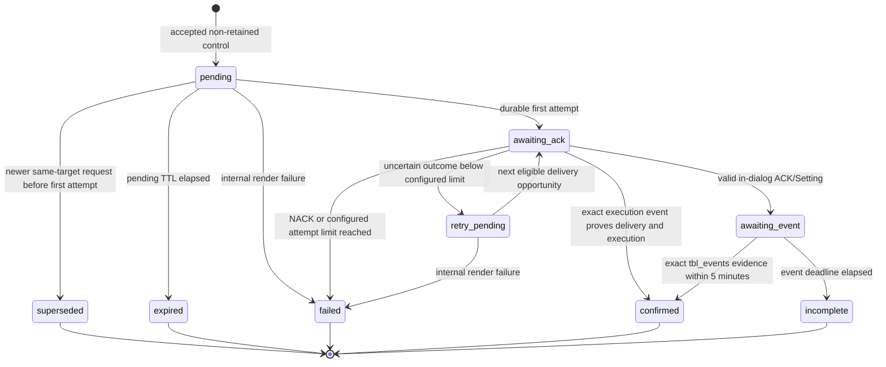

# Local Setting Transaction Hardening Design

Status: Approved for implementation planning on 2026-08-06.
Date: 2026-08-06
Base branch: `main`
Current released add-on version: `2.1.1`
Target release version: `2.2.0`

## Evidence Basis

- Use the passive proxy-capture reconstruction completed on 2026-08-06 as the wire-behavior baseline.
- Preserve the observed half-duplex command dialogue: `IsNewSet -> Setting -> ACK/Setting -> next Setting or END`.
- Treat `ACK/Setting` as delivery evidence only.
- Treat an exact `tbl_events`, `Type=Setting` event as execution evidence.
- Preserve stable retry identity: `ID`, `ID_Set`, `DT`, target, and value.
- Refresh only `TSec`, `ver`, and CRC for each retry attempt.
- Keep `ID_Server=9` by explicit operator decision. Historical captures used `ID_Server=5`; this design does not infer or change the selected value.
- Do not replay traffic or send commands to a real BOX, cloud endpoint, or MQTT broker while implementing or verifying this change.

## Problem

The current local-setting path does not provide a safe transaction boundary. Its process-wide in-memory queue and inflight state can overwrite a sent same-key command, correlate unrelated ACKs or events, lose work at restart, bypass validation through a replay file, and claim confirmation before execution evidence exists. The path can also pre-empt the cloud before the cloud has answered an `IsNewSet` poll, react to non-setting polls, drop coalesced frames, and remain active despite `control_mqtt_enabled=false`.

The result can be protocol corruption, cross-device delivery, false Home Assistant state, silent command loss, or unsafe retries.

## Goals

- Make every local setting a durable, device-bound transaction.
- Preserve cloud priority in ONLINE and HYBRID operation.
- Deliver local settings only after the cloud closes the active setting batch with `END`.
- Maintain exactly one response for every BOX request in OFFLINE operation.
- Distinguish delivery acknowledgement from execution confirmation.
- Retry uncertain delivery with stable wire identity and bounded attempts.
- Survive process and add-on restarts without changing command identity.
- Enforce the control flag, topic identity, retain policy, allowlist, range, step, finite-number, XML, direction, session, and CRC boundaries.
- Preserve byte transparency when no local setting is substituted.
- Make persistent state, prepared wire bytes, explicit writer outcomes, transitions, and terminal results auditable under one stable identity.
- Cover the state machine and wire contract with unit and local fake-endpoint E2E tests.

## Non-Goals

- Do not send a live command during development, tests, review, or rollout preparation.
- Do not connect tests to the production BOX, cloud service, Home Assistant MQTT broker, or telemetry broker.
- Do not change cloud-originated Setting payloads or cloud command semantics.
- Do not change `ID_Server` from the operator-selected value `9`.
- Do not reconstruct unsupported firmware, weather, or unrelated table behavior.
- Do not broaden the control write allowlist without separately validated constraints.
- Do not import the old process-memory queue during upgrade; no durable source exists to migrate.
- Do not preserve `/data/replay_setting_frame.xml` or any equivalent production raw-frame injection path.
- Do not add a new external runtime dependency; use Python's standard SQLite support.

## Safety Invariants

1. No local Setting is emitted before the cloud returns the terminal `END` for the active `IsNewSet` cycle, unless the mode manager selected OFFLINE before the poll.
2. A cloud Setting always wins. It is forwarded byte-for-byte and its BOX acknowledgement is forwarded to the cloud.
3. A local `ACK/Setting` is consumed only inside the same connection and active local dialogue that emitted the Setting.
4. A local ACK never marks execution confirmed and never updates the reported setting state.
5. Confirmation requires a valid BOX-to-proxy `tbl_events`, `Type=Setting` frame with the same device, table, key, and canonical new value before the event deadline.
6. A sent command is immutable. A newer same-key request cannot overwrite it.
7. A retry preserves `ID`, `ID_Set`, `DT`, device, table, key, value, `Confirm=New`, and `ID_Server=9`.
8. A command is attempted at most `control_max_attempts` times and never more than eight times. A NACK is terminal and is never retried automatically.
9. Invalid-CRC traffic cannot bind identity, select a command, advance a transaction, or confirm state.
10. ONLINE traffic is byte-transparent unless one correlated cloud `END` is replaced by a local Setting or a proxy-owned local dialogue must suppress/hold traffic the cloud did not originate.
11. Local Setting delivery is triggered only by `IsNewSet`; never by `IsNewFW`, `IsNewWeather`, or an unrelated frame.
12. `control_mqtt_enabled=false` causes zero local Setting writes and zero control-topic subscriptions.
13. Retained control messages are rejected before enqueue or state mutation.
14. No command is accepted or delivered while the device identity is unknown.
15. Every durable state transition and actual outbound attempt uses the command's original `command_id` and `audit_id`.

## Approved Configuration

| Add-on option | Environment variable | Default | Rule |
|---|---|---:|---|
| `control_mqtt_enabled` | `CONTROL_MQTT_ENABLED` | `false` | Hard gate for subscriptions and local delivery |
| `control_ack_timeout_s` | `CONTROL_ACK_TIMEOUT_S` | `30` | Time from durable attempt start to valid `ACK/Setting` |
| `control_event_timeout_s` | `CONTROL_EVENT_TIMEOUT_S` | `300` | Time from ACK to exact execution event |
| `control_command_ttl_s` | `CONTROL_COMMAND_TTL_S` | `900` | TTL for commands never attempted |
| `control_max_attempts` | `CONTROL_MAX_ATTEMPTS` | `8` | Inclusive delivery-attempt limit |

Internal configuration:

- `TWIN_DB_PATH`, default `/data/twin_queue.db`.
- `CLOUD_DIALOG_TIMEOUT_S`, default 30 seconds, for one forwarded `IsNewSet` cycle to reach a valid terminal response.
- Minimum `control_ack_timeout_s`: 1 second.
- Minimum `control_event_timeout_s`: 1 second.
- Minimum `control_command_ttl_s`: 1 second.
- Valid `control_max_attempts`: 1 through 8; shipped default remains the hard maximum of 8.
- Invalid nonnumeric lifecycle values fall back to shipped defaults with one startup warning; numeric values are clamped to the documented safety bounds.

Compatibility rule:

- Keep `cloud_ack_timeout` and `CLOUD_ACK_TIMEOUT` accepted throughout the 2.2.x line as deprecated compatibility input; remove the local-control alias no earlier than 2.3.0.
- `CONTROL_ACK_TIMEOUT_S` has precedence.
- A direct non-add-on deployment that omits `CONTROL_ACK_TIMEOUT_S` may use `CLOUD_ACK_TIMEOUT` as the fallback.
- The add-on `run` bridge always exports the new option, so the shipped local ACK default is 30 seconds and is not inherited from the old add-on value of 1800 seconds.
- Emit one startup deprecation warning when fallback to `CLOUD_ACK_TIMEOUT` occurs.
- Do not use `cloud_ack_timeout` for event confirmation.

Precedence truth table:

| New input | Legacy input | Result |
|---|---|---|
| valid | any | validated and clamped new value |
| absent | valid | validated and clamped legacy value plus deprecation warning |
| absent | absent | 30 seconds |
| invalid | any | 30 seconds plus invalid-new warning |
| absent | invalid | 30 seconds plus invalid-legacy warning |

## Architecture

### Component Boundaries

`TwinControlHandler`

- Own exact-device MQTT subscriptions and ingress validation.
- Reject retained messages.
- Validate topic device, payload structure, allowlist, canonical value, range, step, and finite-number rules.
- Create a durable command through `TwinCommandStore`.
- Route the existing `proxy_control` target through its local-only handler after the same topic, retain, allowlist, and value checks; never create a wire command for `proxy_control`.
- Never allocate wire IDs or write to a BOX.

`TwinCommandStore`

- Own `/data/twin_queue.db`, schema migration, WAL setup, durable counters, commands, attempts, and transition history.
- Hold an exclusive process-lifetime OS lock on `/data/twin_queue.db.lock`; loss or contention disables local control fail-closed while normal proxy forwarding continues.
- Provide atomic enqueue, supersede, claim, ACK, NACK, retry, confirmation, timeout, and recovery operations.
- Use UTC epoch milliseconds for deadlines and ordering.
- Provide the only mutation interface for transaction state.

`TwinCoordinator`

- Own per-device command selection and state-machine decisions.
- Serialize mutations with an `asyncio.Lock` per device and SQLite transactions.
- Prepare stable fields, render the attempt through the protocol builder, and commit the claim plus exact rendered bytes atomically before socket write.
- Hold the per-device lock from dialogue ownership validation through state commit and serialized BOX write.
- Correlate local ACK/NACK and execution events through connection and command context.
- Expose passive queue and lifecycle status to telemetry.

`SettingDialog`

- Exist only for one TCP connection.
- Track the active `IsNewSet` cycle, cloud-owned Setting batch, optional deferred raw cloud `END`, and at most one local command awaiting ACK.
- Hold bounded raw BOX and cloud frames that arrive after substitution but cannot be forwarded without violating response order.
- Never survive a socket close or process restart.
- Hold raw deferred `END` bytes only in memory because they are valid only for that socket dialogue.
- Use a globally unique UUID session ID persisted on every active attempt; never rely on a process-local counter or object address.

`ProxyServer`

- Parse stream boundaries without assuming one TCP read equals one frame.
- Preserve raw frames and ordering through a response-expectation FIFO.
- Delegate lifecycle decisions to `TwinCoordinator`.
- Keep cloud forwarding, local substitution, capture, and write failure handling explicit.
- Use one serialized BOX writer path so cloud forwarding, local Setting writes, local GetActual writes, and final END writes cannot interleave bytes.

`SettingConfirmationMatcher`

- Parse only valid BOX-to-proxy `tbl_events` frames with `Type=Setting`.
- Extract the original table, key, old value, and new value from the event content using a strict anchored grammar.
- Confirm the oldest eligible `awaiting_event` command with an exact device, table, key, and canonical new-value match.
- Never treat the event-side `ID_Set` as the command-side `ID_Set`.

`SettingsAuditPublisher`

- Project committed store transitions into the existing telemetry format.
- Use the persisted `audit_id`, actual wire `ID`, actual wire `ID_Set`, actual rendered XML, session ID, attempt number, and error.
- Never create replacement identities for delivery or confirmation steps.
- Keep SQLite as source of truth when telemetry publication fails.

### Expected File Ownership

- `addon/oig-proxy/twin/store.py`: SQLite schema and transaction repository.
- `addon/oig-proxy/twin/state.py`: immutable command model, state enum, transition types; remove process-wide dictionary queue semantics.
- `addon/oig-proxy/twin/delivery.py`: coordinator behavior; remove global compatibility inflight state and key-only acknowledgement.
- `addon/oig-proxy/twin/handler.py`: exact-device, non-retained, validated MQTT ingress.
- `addon/oig-proxy/twin/ack_parser.py`: strict ACK/NACK and `tbl_events` evidence parsing.
- `addon/oig-proxy/protocol/frames.py`: one canonical Setting serializer with stable and attempt-specific fields.
- `addon/oig-proxy/protocol/crc.py`: reusable inbound CRC verification API.
- `addon/oig-proxy/proxy/server.py`: cloud-first and offline dialogue routing; remove replay injection.
- `addon/oig-proxy/mqtt/client.py`: retain metadata delivery, exact subscriptions, control discovery enable/cleanup, confirmed-state publication boundary.
- `addon/oig-proxy/config.py`, `addon/oig-proxy/config.json`, `addon/oig-proxy/run`: hard control gate and lifecycle configuration.
- `addon/oig-proxy/main.py`: dependency wiring, database startup/recovery, handler lifecycle.
- `addon/oig-proxy/telemetry/settings_audit.py`, `addon/oig-proxy/telemetry/collector.py`: persistent identity and new lifecycle result projection.
- `docs/v2/configuration.md`, `docs/v2/twin.md`, `docs/v2/architecture.md`: shipped behavior and operator guidance.
- `tests/v2/`: unit, integration, and local fake-endpoint E2E coverage.

## Durable Data Model

### `schema_meta`

| Column | Purpose |
|---|---|
| `schema_version` | Monotonic database schema version |
| `created_at_ms` | Database creation time |

### `devices`

| Column | Purpose |
|---|---|
| `device_id` | Primary key; normalized exact BOX identity |
| `first_seen_at_ms` | First valid-CRC observation |
| `last_seen_at_ms` | Latest valid-CRC observation |
| `next_wire_id` | Durable next local `ID` counter |
| `next_wire_id_set` | Durable next local `ID_Set` counter |

### `control_ingress_audit`

| Column | Purpose |
|---|---|
| `ingress_id` | Stable primary key created before payload disposition |
| `received_at_ms` | Proxy receipt time |
| `topic`, `topic_device_id` | Bounded routing evidence |
| `retain` | Broker retain flag |
| `disposition` | Accepted or exact rejection class |
| `reason` | Sanitized bounded explanation |
| `raw_text` | Bounded or redacted ingress payload |
| `command_id`, `audit_id` | Nullable link populated only for an accepted wire command |

Rejected retained, malformed, unauthorized, and invalid inputs use this table and never create a command transition. If the store is unavailable, emit only the bounded emergency log/counter and reject the input; never accept a command solely because its rejection audit cannot be stored.

### `commands`

| Column | Purpose |
|---|---|
| `command_id` | Stable internal primary key generated at accepted ingress |
| `audit_id` | Stable external audit identity; unique and immutable |
| `device_id` | Exact target; foreign devices cannot claim it |
| `table_name` | Allowlisted target table |
| `item_name` | Allowlisted target key |
| `value_text` | Canonical protocol value |
| `raw_ingress_text` | Bounded or redacted original MQTT input |
| `state` | Current state enum |
| `created_at_ms` | FIFO order and pending TTL origin |
| `updated_at_ms` | Last committed transition |
| `pending_expires_at_ms` | Deadline used only before first attempt |
| `wire_id` | Stable `ID`; null before first claim |
| `wire_id_set` | Stable `ID_Set`; null before first claim |
| `wire_dt` | Stable Czech civil `DT`; null before first claim |
| `attempt_count` | Number of durable delivery attempts |
| `active_session_id` | Globally unique owning dialogue while awaiting ACK |
| `ack_deadline_ms` | Active ACK deadline or null |
| `event_deadline_ms` | Active execution-event deadline or null |
| `acked_at_ms` | Valid local ACK time or null |
| `ack_device_rdt` | Parsed device-local ACK time used only as supporting sequence evidence |
| `completed_at_ms` | Terminal time or null |
| `predecessor_command_id` | Optional same-target causal predecessor |
| `last_wire_frame` | Exact most recent outbound frame bytes as BLOB |
| `last_error` | Bounded terminal or retry reason |

Indexes and constraints:

- FIFO index on `(device_id, state, created_at_ms, command_id)`.
- Event match index on `(device_id, table_name, item_name, value_text, state, acked_at_ms)`.
- Partial unique index allowing at most one `awaiting_ack` command per device.
- Check constraints for valid state and non-negative attempt count.
- Foreign key from command to device and self-referencing foreign key from successor to predecessor.
- Transactional enqueue constraint allowing at most one nonterminal unsent successor per target.

### `command_attempts`

| Column | Purpose |
|---|---|
| `command_id`, `attempt_number` | Composite primary key and stable attempt identity |
| `session_id` | Globally unique owning TCP dialogue |
| `prepared_at_ms` | Durable render and authorization time |
| `write_started_at_ms` | Set in a commit immediately before invoking the writer |
| `drain_completed_at_ms` | Set only after writer drain returns successfully |
| `ack_deadline_ms` | Persisted attempt deadline |
| `tsec_text`, `ver_text`, `crc_text` | Attempt-specific wire fields |
| `wire_frame` | Exact prepared frame bytes as BLOB |
| `wire_length` | Prepared byte count |
| `write_outcome` | `prepared`, `started`, `drained`, `unknown`, or `failed` |
| `write_error` | Sanitized bounded failure detail |
| `response_fingerprint`, `response_rdt` | Nullable accepted ACK/NACK deduplication and sequence evidence |

`drained` means the serialized asyncio writer accepted the frame and `drain()` returned; it does not claim that the BOX received or executed it. Any attempt without a durable `drain_completed_at_ms` has an uncertain wire outcome.

### `command_transitions`

| Column | Purpose |
|---|---|
| `transition_id` | Monotonic primary key |
| `command_id` | Parent transaction |
| `audit_id` | Denormalized stable correlation identity |
| `from_state`, `to_state` | Exact lifecycle edge |
| `occurred_at_ms` | Durable transition time |
| `attempt_number` | Attempt associated with the edge |
| `session_id` | Local connection identity when applicable |
| `reason` | Machine-readable transition reason |
| `error_text` | Bounded diagnostic text |
| `wire_frame` | Exact outbound frame bytes as BLOB for attempt transitions |
| `evidence_frame` | Exact bounded execution-event bytes as BLOB for confirmation |

### `event_receipts`

| Column | Purpose |
|---|---|
| `evidence_id` | Primary key derived from device ID, event-side `ID_Set`, device `DT`, and exact `Content` |
| `received_at_ms` | Proxy receipt time captured at complete-frame assembly |
| `device_id`, `event_id_set`, `device_dt` | Immutable event envelope fields |
| `table_name`, `item_name`, `old_value_text`, `new_value_text` | Strict parsed evidence |
| `evidence_frame` | Bounded exact raw frame bytes |
| `disposition` | `confirmed` or `unmatched` |
| `command_id` | Nullable command confirmed by this evidence |
| `duplicate_count`, `last_seen_at_ms` | Idempotent retransmission evidence |

Insert the evidence receipt and confirm at most one already-`awaiting_event` command in the same transaction. A repeated `evidence_id`, including after restart, only updates duplicate metadata and can never confirm another command. Unmatched evidence remains unmatched and cannot be applied to a command accepted later. Distinct event identities with the same target and value may confirm distinct eligible commands in FIFO order. Invalid evidence never enters this table and remains passive capture/audit data only.

Every command mutation and its transition row commit in one `BEGIN IMMEDIATE` transaction. The attempt preparation operation allocates or reuses stable identity, generates attempt-specific fields, renders the exact frame, increments the attempt count, stores the frame and attempt, changes state, and sets the ACK deadline in one transaction before socket write. Commit `write_started` immediately before invoking the writer. Commit `attempt_drained` after successful drain or `write_outcome_unknown`/`write_failed` after an exception. A crash after preparation or write start is therefore an uncertain attempt and retries with the same stable identity.

## Command State Machine



State semantics:

- `pending`: never attempted; subject to the 900-second default TTL.
- `retry_pending`: attempted at least once; not subject to pending TTL.
- `awaiting_ack`: current or uncertain wire delivery; one per device.
- `awaiting_event`: BOX acknowledged receipt; delivery complete, execution unconfirmed.
- `confirmed`: exact event evidence received before deadline.
- `incomplete`: delivery acknowledged but no exact event arrived before the persisted event deadline; shipped default is five minutes.
- `failed`: NACK or exhausted delivery attempts.
- `expired`: never-attempted command exceeded TTL.
- `superseded`: never-attempted same-target command replaced by a newer request.

Terminal states are immutable. A late event may continue through the generic sensor/event pipeline but cannot rewrite an `incomplete`, `failed`, `expired`, or `superseded` command to `confirmed`.

## Same-Target Ordering

- Key identity is `(device_id, table_name, item_name)`.
- A new request may supersede only the newest matching `pending` command with `attempt_count=0`.
- Preserve the superseded row and terminal audit transition.
- Never supersede `awaiting_ack`, `retry_pending`, or `awaiting_event` work.
- Attach the new command as successor to the latest non-superseded same-target command.
- If an active command already has an unsent successor, a newer request supersedes that unsent successor only; the sent predecessor remains unchanged.
- Select commands FIFO by `created_at_ms`, then `command_id` for deterministic ties.
- Allow multiple `awaiting_event` commands after a delivered batch.
- Block a same-target, same-value successor while an earlier command with that value remains `awaiting_event`; a same-target successor with a different value may continue in the approved batch.
- Block every successor while its same-target predecessor remains `pending`, `retry_pending`, or `awaiting_ack`.
- When multiple awaiting commands have the same exact target and value, match an event to the oldest eligible command whose `acked_at_ms <= received_at_ms <= event_deadline_ms`.

## Wire Identity and Serialization

Allocate stable fields on the first durable attempt:

- `ID`: next durable per-device wire record ID.
- `ID_Set`: greater than both the durable per-device counter and the latest valid observed `ID_Set`.
- `DT`: Czech civil time derived once from the first-attempt instant.
- `ID_Device`: exact persisted target.
- `NewValue`: persisted canonical value, XML-escaped.
- `Confirm`: `New`.
- `TblName`, `TblItem`: persisted allowlisted target.
- `ID_Server`: `9`.
- `ID_SubD`: `0`.
- `mytimediff`: `0`.
- `Reason`: `Setting`.

Generate per-attempt fields:

- `TSec`: current attempt time; never earlier than the stable `DT` instant.
- `ver`: new five-digit decimal uint16-compatible value.
- `CRC`: CRC-16/MODBUS over the exact inner XML preceding `<CRC>`.

Required field order:

```text
ID, ID_Device, ID_Set, ID_SubD, DT, NewValue, Confirm, TblName,
TblItem, ID_Server, mytimediff, Reason, TSec, ver, CRC
```

Required framing:

```text
<Frame>{ordered children}<CRC>{zero-padded decimal CRC5}</CRC></Frame>\r\n
```

Use one serializer for ONLINE and OFFLINE delivery. Record the exact final bytes before write. Tests calculate CRC independently of production helpers.

## ONLINE and HYBRID Dialogue

### Cloud-First Cycle

1. Receive a complete valid BOX `IsNewSet` frame.
2. Bind or verify the connection device identity.
3. Open an `IsNewSet` cycle token in the connection-local response tracker before the cloud write.
4. Forward the raw poll to the cloud without modification; remove the token and close on write failure.
5. Forward every cloud Setting byte-for-byte and mark the cycle as cloud-owned.
6. Forward BOX `ACK/Setting` frames belonging to the cloud batch byte-for-byte as continuations of that cycle, not independent request FIFO entries.
7. Continue forwarding subsequent cloud Settings byte-for-byte.
8. Act only when the cloud returns the terminal `END` for that cycle.

Start the connection-local cycle deadline when the poll is forwarded. On cloud EOF, parser failure, timeout, or missing valid terminal response, remove the cycle token, perform no local substitution, discard socket-only held frames, and close both connection legs. Never correlate later traffic to a stale cycle.

At terminal cloud `END`:

- No eligible local command: forward the raw END and close the cycle.
- Eligible local command: retain the exact raw END in `SettingDialog`, atomically claim one local command, and write only the local Setting to the BOX.
- Active delivery owned by another session for the same device: forward this session's raw END and close this cycle; never wait, steal ownership, or skip to a successor.
- Invalid cloud CRC: forward byte-for-byte; do not treat the frame as a substitutable END.
- Cloud NACK or another terminal response: forward byte-for-byte, close the cycle, and do not inject local work.
- Any invalid or structurally unexpected cloud response taints and closes the current cycle token. Forward available complete frames byte-for-byte and prohibit local substitution until a fresh valid `IsNewSet` cycle.

### Local Batch After Deferred END

On valid in-dialog BOX `ACK/Setting`:

1. Do not forward the ACK to the cloud; the cloud already closed its batch.
2. Commit `awaiting_ack -> awaiting_event` with the active local command.
3. Do not publish the requested value as confirmed state.
4. In one database transaction, compare-and-swap the owning session, commit the ACK, and claim/prepare the next eligible local command for the same device when present.
5. Otherwise send the exact deferred cloud END bytes and close the local batch.

On valid in-dialog BOX NACK:

1. Do not forward the NACK to the cloud.
2. Commit the active command as `failed` with the NACK reason.
3. Do not retry automatically and do not continue the local batch.
4. Send the exact deferred cloud END and close the cycle.

On write failure, connection loss, a new request boundary before ACK, or ACK timeout:

1. Commit the active command to `retry_pending`, or `failed` if the configured attempt limit was reached.
2. Discard the socket-scoped deferred END.
3. Close the affected connection when response integrity is uncertain.
4. Retry only at the next eligible cloud terminal END on a new dialogue.

Commit retry or terminal failure before releasing per-device dialogue ownership. ACK, NACK, timeout, disconnect, and retry mutations require exact persisted `active_session_id` equality.

Cloud connection failure is not an implicit cloud END. Local injection begins only when the mode manager has selected OFFLINE before a fresh valid `IsNewSet` poll.

### Byte and Frame Preservation

- Maintain a connection-local FIFO for forwarded BOX requests and their expected cloud responses.
- Correlate the terminal END with the active `IsNewSet` cycle, including cycles containing cloud Settings.
- Defer later unrelated BOX requests while a cloud-owned `IsNewSet` continuation remains open.
- Buffer partial TCP data until a complete `</Frame>\r\n` boundary exists.
- Preserve raw bytes, CRLF, order, and all unrelated coalesced frames.
- Substitute exactly one correlated END frame; never discard preceding or following frames from the same TCP read.
- Once substitution begins, hold later coalesced cloud frames until the original deferred END has been sent; then flush them in original order.
- Hold later coalesced BOX frames that cannot safely enter a new cloud dialogue until the local batch closes; then forward them in original order.
- Give `SettingDialog` exclusive semantic ownership of BOX output from successful substitution through deferred/synthesized END. Pause local GetActual and hold generic offline or unrelated cloud responses during that interval.
- Limit each stream assembly buffer and each held-frame queue to 1 MiB. On overflow, record the protocol error, retry any uncertain local attempt under normal limits, and close the connection.
- On EOF with an incomplete frame, forbidden terminator, or unterminated frame, record a bounded diagnostic, clear socket-local dialogue state, perform no new local mutation, and close the connection.
- Serialize every write to the BOX through one lock or writer queue.

## OFFLINE Dialogue

- Use the same durable queue, identity allocation, serializer, ACK correlation, event confirmation, timeout, and retry rules.
- A valid `IsNewSet` poll with an eligible command receives exactly one Setting response.
- A valid `IsNewSet` poll without an eligible command receives exactly one synthesized END response from the existing canonical `build_end_time_frame()` serializer.
- A valid `IsNewSet` poll while another session owns delivery for the same device receives exactly one synthesized END; it cannot claim a successor.
- A valid local `ACK/Setting` receives exactly one next Setting or one synthesized final END from the same serializer.
- A local NACK marks the command failed and receives one synthesized final END.
- Never emit both a generic offline ACK and a Setting for one poll.
- Never emit an ACK in response to a BOX ACK.
- Never trigger Setting delivery from `IsNewFW`, `IsNewWeather`, table upload, or an unrelated ACK.
- Invalid-CRC traffic receives at most the existing offline error response and never selects or mutates a local command.

For every complete CRC-valid OFFLINE request, make exactly one application-level response decision while the socket remains writable. A disabled gate, store/claim/render failure before writer invocation, no eligible command, or active delivery elsewhere selects one synthesized END for `IsNewSet`. Once any response writer invocation starts, never attempt a second response for that request; on partial or uncertain write, persist uncertainty when applicable and close. Malformed and invalid-CRC frames are excluded from the exactly-one guarantee. An uncorrelated ACK/NACK cannot mutate state or trigger a Setting and receives only the existing single generic offline response.

## ACK, NACK, and Event Correlation

ACK acceptance requires all conditions:

- Direction is BOX to proxy.
- CRC is valid.
- Result is `ACK`.
- Reason is exactly `Setting`.
- The same TCP connection has a local `SettingDialog` awaiting ACK.
- The active persisted command matches the dialog device and is in `awaiting_ack`.
- Proxy `received_at_ms`, captured when the complete frame is assembled, is less than or equal to the persisted deadline.
- Exact frame fingerprint was not already accepted in this dialogue.
- Parsed `Rdt`, when present, is not earlier than the previous accepted local response `Rdt` in the batch.

Persist the exact-frame SHA-256 fingerprint and parsed ACK `Rdt` as deduplication and supporting device-sequence evidence. Never use `Rdt` as the wall-clock timeout oracle.

NACK acceptance requires `Result=NACK`, BOX-to-proxy direction, valid CRC, the owning connection and active local dialogue, the matching bound device and `awaiting_ack` command, and proxy `received_at_ms` at or before the persisted ACK deadline. A protocol `Reason=Setting` field is not required because captured BOX error NACKs use diagnostic reasons such as `WC`; store the reason only as sanitized diagnostic evidence.

Event confirmation requires all conditions:

- Direction is BOX to proxy.
- CRC is valid.
- Outer table is `tbl_events`.
- Type is exactly `Setting`.
- Frame `ID_Device` exactly matches the persisted command device.
- Strict event content yields the same table, key, and canonical new value.
- Command state is `awaiting_event`, or it is the exact active `awaiting_ack` command whose attempt began before event receipt.
- For `awaiting_event`, proxy receipt time is at or before the persisted event deadline, default five minutes after ACK.
- For direct evidence on `awaiting_ack`, proxy receipt time is after attempt preparation and at or before the persisted ACK deadline.
- Device `DT` is supporting sequence evidence only and never controls the wall-clock deadline.
- When parseable ACK `Rdt` and event `DT` exist, event `DT` is not earlier than that command's ACK `Rdt`; an earlier event cannot confirm a later command.

Normalize the event's new value through the same target constraint used at command ingress before exact comparison. Resolve a deadline race inside the per-device lock and SQLite transaction using the persisted deadline and proxy receipt time. Event insertion wins only when its already-captured `received_at_ms` is within the deadline, even if the sweeper acquires the lock first; the sweeper checks pending received evidence before committing timeout.

Match eligible `awaiting_event` commands before the active `awaiting_ack` command. Exact evidence for `awaiting_ack` commits directly to `confirmed`, cancels ACK retry, and proves delivery through execution. Process and capture the evidence locally, abort the local batch without sending a successor, discard socket-scoped deferred/held frames, and close the connection to re-establish dialogue ordering. Do not retry the confirmed command. A BOX retry of the event on a fresh connection remains byte-transparent and idempotent through `event_receipts`.

Foreign, ambiguous, malformed, wrong-direction, invalid-CRC, and out-of-dialog frames remain observable but cannot mutate local transaction state. When no proxy-owned local dialogue exists, ONLINE forwarding remains unchanged for those frames. While awaiting a proxy-originated Setting response, never forward an unexpected BOX frame or rejected ACK/NACK candidate to the cloud: persist retry/failure for an uncertain attempt, discard the socket-scoped END, and close the connection. The exact execution-event exception follows the direct-confirmation rule above.

### ACK/NACK Protocol Limitation

Captured `ACK/Setting` frames contain no command-side `ID` or `ID_Set`; correlation is inherently sequential. The approved multi-command local batch therefore relies on the same strict half-duplex ordering observed in real cloud batches and guaranteed byte ordering within one TCP connection. Exact response fingerprint deduplication, persisted session ownership, `Rdt` ordering, and write-before-response checks reject observable duplicates, but a BOX-generated novel duplicate with new `Rdt`, `ver`, and CRC is indistinguishable from the response to the next Setting. This residual protocol limitation must remain explicit in operator documentation and PR review; removing it completely would require one local Setting per `IsNewSet` cycle, contrary to the approved batch decision.

## Input and Protocol Validation

### MQTT Boundary

- Subscribe only to `oig/{exact_device_id}/control/set` and the exact-device compatibility topic.
- Do not use `+` or `#` for the device segment.
- Require a device ID already learned from a valid BOX frame or persisted through `DeviceIdManager` and revalidated on connection.
- Compare topic device to payload target and bound device; reject any mismatch.
- Extend the MQTT callback contract to expose the broker retain flag.
- Reject `retain=true` before command creation, JSON interpretation, or proxy-control dispatch.
- Reject missing, extra-typed, oversized, or malformed fields with a bounded audit reason.
- Preserve current control write allowlist as the outer authorization boundary.

### Numeric and Step Rules

- Parse with decimal semantics; do not use binary float modulo for step validation.
- Reject booleans where a numeric value is expected unless a specific constraint explicitly defines boolean aliases.
- Reject NaN, positive infinity, and negative infinity in numeric and string form.
- Enforce inclusive minimum and maximum.
- Enforce `integer_only` before canonicalization.
- Enforce `(value - minimum) mod step == 0`; use zero as the step origin only when no minimum exists.
- Persist one canonical decimal string without scientific notation.

### XML and CRC Rules

- Permit dynamic table and item element names only after allowlist validation.
- XML-escape every text value, device ID, and other dynamic text field.
- Reject characters forbidden by XML 1.0.
- Validate CRC against the exact inbound frame bytes before any local state effect.
- ONLINE invalid frames remain byte-transparent only when no proxy-owned local dialogue is active; the active-dialogue exception closes uncertain ownership without forwarding proxy-owned responses to cloud.
- OFFLINE invalid frames never produce a Setting.

## Device Binding and Control Lifecycle

- Sample `control_mqtt_enabled` at process startup; changing the add-on option requires restart in 2.2.0.
- Bind each TCP connection to the first valid, non-empty BOX `ID_Device`.
- Reject identity changes inside the connection for local-control purposes and record a security diagnostic.
- Scope locks, active delivery, counters, queue selection, ACK matching, event matching, and status to the exact device.
- Allow at most one local `awaiting_ack` command per device even if duplicate TCP sessions exist.
- Do not start a wildcard control handler while identity is unknown.
- Start exact subscriptions only when both MQTT is ready and `control_mqtt_enabled=true`.
- Unsubscribe exact control topics when the handler stops.
- When control is disabled, keep telemetry and sensor discovery but publish retained zero-length tombstones for every control entity discovery topic.
- Use the persisted device ID and any valid device observed after startup to clean stale retained control discovery.
- Keep pending and retry commands durable while delivery is disabled. Pending TTL and event deadlines still advance; no wire attempt occurs until re-enabled.
- Continue passive exact event matching for previously acknowledged commands; it sends no control traffic.
- Re-enable claims only on a fresh eligible dialogue after restart; never resume a socket-local deferred END.

## Persistence, Recovery, and Deadlines

Startup sequence:

1. Acquire the exclusive lock, open schema version 1, enable WAL, `synchronous=FULL`, foreign keys, a 5000-millisecond busy timeout, and versioned idempotent migrations.
2. Expire overdue never-attempted `pending` commands.
3. Convert every recovered `awaiting_ack` command below the configured limit to `retry_pending`; mark it `failed` when `attempt_count >= control_max_attempts`.
4. Mark every recovered `retry_pending` command `failed` when `attempt_count >= control_max_attempts`.
5. Keep non-expired `awaiting_event` commands waiting with their original event deadlines.
6. Mark overdue `awaiting_event` commands `incomplete`.
7. Preserve stable wire IDs, `DT`, attempt count, audit identity, attempt rows, evidence receipts, and transition history.
8. Start MQTT subscriptions only after store recovery succeeds.

Runtime deadline handling:

- Use wall-clock UTC timestamps for persistence and restart recovery.
- Use monotonic timers only as an in-process wake-up optimization.
- Re-check persisted state and wall-clock deadline inside the transaction before every timeout transition.
- Sweep deadlines at startup and at a bounded interval no greater than one second while control transactions exist.

Database failure policy:

- Fail closed for new command acceptance and local wire delivery.
- Continue transparent ONLINE proxy forwarding.
- Continue normal non-control OFFLINE responses.
- Log and expose a degraded control status without including secrets or unbounded payloads.
- Never emit a local Setting whose durable attempt row was not committed.
- If a state commit fails after a local Setting was emitted, do not forward the locally owned BOX response to the cloud; close the connection and let restart recovery treat the durable `awaiting_ack` record as uncertain.
- Never delete, replace, truncate, or silently recreate an existing database after migration failure, corruption, disk-full, I/O failure, lock loss, or repeated busy timeout.
- Treat a newer unsupported schema as store-unavailable and preserve it unchanged.
- Resume local control only after reopening, pragma readback, migration, and full deadline reconciliation all commit successfully; otherwise exit for supervisor restart after bounded retries.

No migration exists for the old in-memory queue. First 2.2.0 startup creates schema version 1; commands not durably present cannot be recovered. Rollback to 2.1.1 ignores and preserves the database file. Future migrations execute one schema version per transaction and never downgrade in place.

## Audit, Capture, and MQTT State

- Create `command_id` and `audit_id` once at accepted ingress.
- Record all ingress dispositions in `control_ingress_audit`; rejected input never masquerades as a command transition.
- Record enqueued, superseded, selected, attempt-prepared, write-started, attempt-drained, write-unknown/failed, ACK-observed, retry, NACK, event-confirmed, expired, incomplete, and failed command transitions.
- Store and report the wire `ID`, `ID_Set`, stable `DT`, attempt-specific `TSec`, `ver`, CRC, prepared frame, and explicit write outcome under the original identities.
- Call a frame "outbound" only after writer invocation. Call it "drained" only after `drain()` returns; neither term claims BOX receipt or execution.
- Capture every locally generated Setting passed to the BOX writer as `proxy_to_box` in ONLINE and OFFLINE modes and link it to the exact attempt row.
- Capture the deferred cloud END as `cloud_to_proxy` when originally received and as `proxy_to_box` when later forwarded without changing its raw bytes.
- Redact sensitive values through the existing audit policy before telemetry projection.
- Bound stored ingress, error, and evidence text; keep the full local Setting wire frame because it contains only allowlisted fields and the validated value.
- Publish requested command lifecycle separately from device state.
- Publish the setting value to the existing MQTT/HA state path only after a committed exact `tbl_events` confirmation.
- Never publish confirmed state on ACK, timeout, NACK, retry, queue removal, or snapshot inference.

## Removed Behavior

- Delete `_read_replay_frame_once()` and the `/data/replay_setting_frame.xml` branch.
- Delete key-only and process-global inflight compatibility paths.
- Delete immediate pre-cloud injection on BOX polls.
- Delete injection triggers for `IsNewFW` and `IsNewWeather`.
- Delete ACK-based state publication.
- Replace in-memory queue deletion on timeout with durable bounded retry.
- Remove wildcard device control subscriptions.
- Remove current documentation that describes overwrite, no persistence, synthetic short Setting payloads, or ACK as execution confirmation.

## Error Handling

- Invalid MQTT input: reject, audit, and continue.
- Retained control: reject, audit/counter, and continue.
- Store unavailable: reject new controls and keep proxy forwarding.
- Setting render failure: mark failed before any write, forward the unmodified cloud END when ONLINE/HYBRID, or send one synthesized END when OFFLINE.
- BOX write uncertainty: persist retry or failure, then close the connection.
- Deferred END write failure: close the connection; do not change an already ACKed command back to unacknowledged.
- ACK timeout: persist retry or failure, then close the connection.
- Event timeout: mark incomplete; do not retry delivery because BOX already acknowledged it.
- NACK: mark failed, preserve reason, send final END when the socket remains writable.
- Exact duplicate ACK/NACK fingerprint: no state change.
- Duplicate exact event: confirm at most one eligible transaction.
- Telemetry publish failure: retain database truth and continue protocol handling.
- Capture failure: log and continue; never change the wire decision.

## Testing Strategy

Use red-green-refactor for every state transition and protocol branch. Use only in-process writers, temporary SQLite databases, fake MQTT messages, and loopback fake BOX/cloud endpoints.

### Unit Tests

Store and recovery:

- Schema creation and repeated idempotent startup.
- WAL and foreign-key configuration.
- Exclusive process lock, unsupported-newer-schema, migration rollback, corruption, disk-full, and busy-timeout fail-closed behavior.
- Atomic enqueue, FIFO claim, transition history, and unique active-delivery guard.
- Restart recovery for `pending`, `awaiting_ack`, `retry_pending`, `awaiting_event`, and terminal states.
- Stable IDs and `DT` across retries; refreshed `TSec`, `ver`, and CRC.
- Pending TTL, ACK deadline, event deadline, configured attempt limit at values 1 and 8, and NACK terminal behavior.
- Same-key replacement before first attempt and successor ordering after any sent attempt.
- Concurrent same-device claims and distinct-device independence.
- Active-delivery-elsewhere outcome for duplicate sessions; losing sessions receive END and never steal or skip work.
- Attempt preparation, write start, drain completion, write failure, unknown outcome, and post-emission store failure.
- Evidence receipt replay before and after restart confirms at most one command; two distinct evidence IDs may confirm two eligible commands.
- Exact deadline boundaries and both event-versus-sweeper lock interleavings.

Validation and ingress:

- Disabled control flag produces no subscriptions and no enqueue.
- Exact device topic accepted; wildcard, wrong-device, unknown-device, and payload mismatch rejected.
- Retained JSON and compatibility-topic controls rejected.
- Allowlist, range, integer, finite value, step, canonical decimal, oversized text, and XML escaping cases.
- Deprecated timeout precedence and warning.
- Control discovery creation when enabled and retained tombstone cleanup when disabled.
- Startup disabled with pre-existing `pending`, `retry_pending`, `awaiting_ack`, and `awaiting_event` rows; no claims or writes, deadlines advance, passive event confirmation remains allowed.

Protocol and correlation:

- Exact golden Setting child order, CRLF terminator, `Confirm=New`, and `ID_Server=9`.
- CRC checked through an independent test implementation.
- Valid and invalid inbound CRC behavior.
- Same-session local ACK accepted; wrong session, wrong direction, wrong reason, stale ACK, and foreign ACK ignored.
- NACK terminal handling, exact ACK/NACK fingerprint idempotence, and monotonic response `Rdt` checks.
- Exact event confirmation; wrong device, table, key, value, time, direction, type, and malformed content rejected.
- Repeated identical-value events use oldest eligible FIFO match.
- Same-target same-value successor remains blocked while identical predecessor awaits evidence.
- Exact event received while `awaiting_ack` confirms without retry and closes the inconsistent dialogue safely.

### Proxy Integration Tests

ONLINE and HYBRID:

- Poll always reaches cloud first.
- Cloud Setting and all cloud batch frames remain byte-identical.
- Local queue remains untouched until correlated cloud END.
- Cloud END is replaced by one local Setting when eligible.
- Local ACK is suppressed from cloud.
- A multi-command local batch sends the next Setting after each ACK.
- Exact deferred cloud END returns after the final local ACK.
- Local NACK returns deferred END and stops the batch.
- Timeout or disconnect retries at the next eligible poll with stable identity.
- No local work is injected on cloud NACK, invalid cloud CRC, cloud timeout, `IsNewFW`, or `IsNewWeather`.
- Disabled control and empty queue are byte-transparent.
- Partial frames and multiple coalesced frames preserve every non-substituted byte and order.
- Boundary-minus-one, exact 1 MiB boundary, overflow, split terminator, malformed terminator, and EOF-partial framing behavior.
- Cloud dialogue timeout, EOF, invalid terminal, and stale-cycle cleanup.
- Local GetActual and cloud writes cannot interleave a Setting frame.
- Proxy-owned local dialogue blocks unexpected BOX frames and pauses unrelated BOX writes until close.

OFFLINE:

- Poll with work returns exactly one Setting.
- Poll without work returns exactly one END.
- ACK with more work returns exactly one next Setting.
- Final ACK returns exactly one END.
- NACK returns exactly one END and no retry.
- Invalid or foreign frames never advance local state.
- Generated Settings appear in frame capture and telemetry.

### Local Fake-Endpoint E2E Tests

- Start the real proxy server on loopback with a temporary database.
- Use a fake BOX client, fake cloud server, and fake MQTT transport.
- Exercise cloud Setting priority followed by deferred END and a local batch.
- Exercise process restart after durable attempt and verify stable retry identity.
- Exercise ACK followed by matching and non-matching `tbl_events` evidence.
- Exercise rapid same-key updates without false confirmation or command loss.
- Install a test egress guard that fails DNS resolution, every non-loopback TCP/UDP connect, and every production transport configuration; inject fake MQTT, BOX, cloud, telemetry, and capture transports explicitly.
- Record the egress-guard result as a CI artifact; logs are diagnostic evidence, not the pass oracle.

### Required Verification Gates

- Focused new tests pass after each slice.
- Full `tests/v2` suite passes.
- Unit and local fake-endpoint E2E coverage exists for every changed branch.
- Production statement and branch coverage are both strictly greater than 80.0%; raise the CI threshold from 69 accordingly.
- `mypy addon/oig-proxy --ignore-missing-imports` passes.
- Repository flake8 and pylint gates pass with no new suppressions hiding functional defects.
- Bandit passes for production Python.
- Semgrep, Gitleaks, and dependency safety checks report no blocking finding introduced by the change.
- Manual OWASP-aligned review covers input injection, authorization/device binding, replay, resource exhaustion, sensitive logging, insecure defaults, and fail-open paths.
- `git diff --check` passes.
- No real endpoint or broker appears in test connection logs.

Required reproducible commands from the repository root:

```bash
.venv/bin/python -m pytest tests/v2 --cov=addon/oig-proxy --cov-branch --cov-report=term-missing --cov-report=xml:reports/coverage.xml --cov-fail-under=80.01
.venv/bin/python -m mypy addon/oig-proxy --ignore-missing-imports
.venv/bin/python -m flake8 addon/oig-proxy tests/v2
PYTHONPATH=addon/oig-proxy .venv/bin/python -m pylint addon/oig-proxy tests/v2
.venv/bin/python -m bandit -r addon/oig-proxy -x addon/oig-proxy/tests
.venv/bin/semgrep --config .semgrep.yml --error addon/oig-proxy
gitleaks detect --source . --config .gitleaks.toml --no-banner
.venv/bin/python -m safety check -r addon/oig-proxy/requirements.txt
git diff --check origin/main...
```

Before implementation starts, the execution plan must add an `SI-1` through `SI-15` traceability matrix mapping every safety invariant to named unit, integration, and E2E test nodes. Attach command outputs, coverage XML, egress-guard result, security reports, and the completed OWASP checklist to the PR evidence. Any secret finding, Bandit medium/high finding, Semgrep error/warning, or dependency vulnerability introduced by the branch is blocking unless a repository owner records a scoped risk acceptance in the PR.

## Rollout

- Implement on branch `codex/local-setting-transaction-hardening`.
- Update add-on, docs, tests, CI threshold, changelog, and version together.
- Release as `2.2.0` because persistence and command lifecycle semantics change materially.
- Keep `control_mqtt_enabled=false` as the upgrade default.
- Create the SQLite database on first start without importing old process memory.
- Log schema version, recovery counts, and control-enabled state without payload values.
- Verify locally only with fake endpoints before opening the PR.
- Send all remote changes through a GitHub pull request using the repository-account wrapper selected from `origin`.
- Require passing tests, lint, mypy, statement and branch coverage above 80.0%, security gates, and PR checks before merge.
- Do not deploy to Home Assistant or enable live control as part of this implementation task without a separate explicit operator authorization and test protocol.

## Acceptance Criteria

- `control_mqtt_enabled=false` results in no control subscription, no control discovery, and no local Setting write.
- Disabling with durable pending, retry, ACK-waiting, or event-waiting rows emits no Setting; deadlines and passive evidence handling follow the documented rules.
- Enabling control creates exact-device subscriptions only after a valid device identity exists.
- Retained, wrong-device, unknown-device, invalid, non-finite, out-of-range, and off-step requests cannot enter the queue.
- ONLINE/HYBRID forwards every valid `IsNewSet` poll to cloud before any local decision.
- Every cloud Setting remains byte-identical and completes before local delivery begins.
- A local Setting replaces only the correlated terminal cloud END.
- Cloud timeout, EOF, malformed response, or invalid terminal clears the cycle without local substitution or stale later correlation.
- A local ACK never reaches cloud, never confirms execution, and causes the next local Setting or the exact deferred END.
- OFFLINE produces exactly one response per poll or ACK.
- Local delivery never triggers on firmware, weather, or unrelated traffic.
- Partial and coalesced frames preserve all unrelated bytes and ordering.
- Duplicate sessions cannot steal active device ownership or skip to a successor.
- Every accepted command is device-bound and durable in `/data/twin_queue.db`.
- Restart preserves `command_id`, `audit_id`, `ID`, `ID_Set`, `DT`, target, value, attempt count, and event deadline.
- Retry refreshes only `TSec`, `ver`, and CRC and stops at the configured limit, shipped default and hard maximum eight.
- NACK is terminal with no automatic retry.
- A new same-key command never overwrites a command that has been attempted.
- ACK moves a command to `awaiting_event`; only exact event evidence before the persisted deadline moves it to `confirmed`, with a shipped default of 300 seconds.
- Missing event evidence produces `incomplete` and never false confirmed state.
- Replaying one execution event before or after restart can confirm at most one command.
- Prepared, write-started, drained, unknown, and failed attempt outcomes remain distinguishable under the original audit identity with exact wire IDs and frame bytes.
- Store corruption, lock contention, migration failure, and write-time state failure disable local control without replacing the database or breaking transparent ONLINE forwarding.
- Generated Setting frames have exact field order, CRLF, `ID_Server=9`, and independently verified CRC.
- Production replay-file injection no longer exists.
- Full tests, local fake-endpoint E2E, mypy, lint, pylint, statement and branch coverage above 80.0%, security checks, and PR checks pass.
- The egress guard proves no live command, production MQTT publication, DNS resolution, or non-loopback endpoint connection occurs during implementation verification.

## Decisions

- Cloud-first substitution at terminal cloud END: approved.
- Cloud Setting priority: approved.
- Local multi-setting batch before deferred END: approved.
- `ID_Server=9`: approved despite historical capture value 5.
- ACK means delivery only: approved.
- Exact event within five minutes means confirmed: approved.
- Missing event means incomplete: approved.
- Retry on uncertain delivery with stable identity: approved.
- Maximum eight attempts and terminal NACK: approved.
- SQLite persistence at `/data/twin_queue.db`: approved.
- Reject retained controls; pending TTL 900 seconds: approved.
- Enforce device, session, direction, CRC, range, step, finite-number, and XML boundaries: approved.
- Remove production replay path: approved.
- Local fake-endpoint E2E only; no active real commands: approved.
- Target release `2.2.0`, feature branch, and PR workflow: approved.
